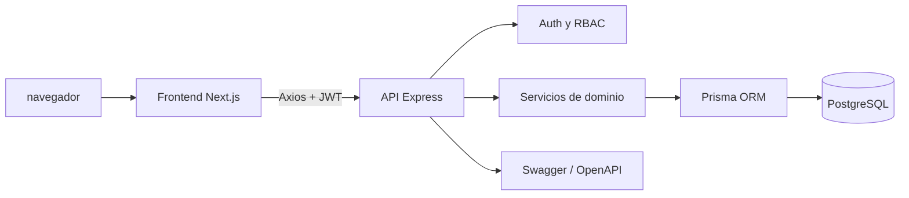

# Arquitectura

## Vista general



El repositorio se divide en dos aplicaciones desplegables:

- `backend/`: API REST, autenticación, autorización, servicios, persistencia y pruebas.
- `frontend/`: aplicación web Next.js con App Router, servicios HTTP y vistas operativas.

## Backend

```text
backend/src/
├── app.ts              composición de Express, CORS, Swagger y rutas
├── server.ts           arranque HTTP
├── config/             entorno, Prisma y Swagger
├── controllers/        adaptación HTTP y respuestas
├── middlewares/        autenticación, roles, validación y errores
├── routes/             definición de endpoints
├── services/           reglas de negocio y acceso coordinado a datos
├── schemas/            esquemas de entrada con Zod
├── types/              ampliaciones de tipos de Express
└── utils/              paginación y serialización
```

La ruta típica de una operación es:

```text
HTTP → route → middleware → controller → service → Prisma → PostgreSQL
```

Las respuestas y errores se centralizan mediante middleware y utilidades compartidas. Los identificadores `BigInt` se serializan antes de enviarse como JSON.

## Módulos de dominio

| Módulo        | Prefijo                         | Responsabilidad                                        |
| ------------- | ------------------------------- | ------------------------------------------------------ |
| Salud         | `/api/health`                   | Disponibilidad básica del servicio.                    |
| Autenticación | `/api/auth`                     | Login y usuario actual.                                |
| Usuarios      | `/api/users`                    | Usuarios, roles y permisos administrativos.            |
| Catálogo      | `/api/catalog`, `/api/products` | Categorías, marcas, unidades, ubicaciones y productos. |
| Monedas       | `/api/currencies`               | Monedas y tasas de cambio.                             |
| Proveedores   | `/api/suppliers`                | Alta, consulta y mantenimiento de proveedores.         |
| Compras       | `/api/orders`                   | Órdenes, recepción y estados de compra.                |
| Finanzas      | `/api/orders`                   | Resumen y pagos asociados a órdenes.                   |
| Inventario    | `/api/inventory`                | Existencias, lotes, alertas, ajustes y movimientos.    |
| Solicitudes   | `/api/requests`                 | Solicitudes internas y despachos.                      |
| Laboratorio   | `/api/lab`                      | Neveras, reactivos, consumo, traslados y descartes.    |
| Reportes      | `/api/reports`                  | Métricas consolidadas para dashboard.                  |
| Exportaciones | `/api/exports`                  | CSV de valorización y Kardex.                          |

## Persistencia

Prisma modela seguridad, monedas, catálogo, compras, inventario, solicitudes y laboratorio en PostgreSQL. El esquema fuente está en `backend/prisma/schema.prisma`; las migraciones viven en `backend/prisma/migrations/` y el seed en `backend/prisma/seed.ts`.

## Frontend

El cliente usa Next.js 16, React 19, Axios y Tailwind CSS. `frontend/src/lib/api-client.ts` configura la URL base, adjunta el token almacenado localmente y redirige al login cuando la API responde `401`.

Las vistas actuales incluyen login, dashboard, solicitudes e inventario/Kardex. Los servicios de `frontend/src/services/` encapsulan las llamadas por dominio y los tipos de `frontend/src/types/` describen sus respuestas.

## Decisiones operativas

- La API y el cliente se ejecutan como procesos independientes.
- El JWT se envía como `Authorization: Bearer <token>`.
- El CORS del backend permite los puertos locales `3000` y `3001`; debe restringirse antes de producción.
- Swagger está disponible en `/api/docs` y sirve como referencia ejecutable del contrato HTTP.
